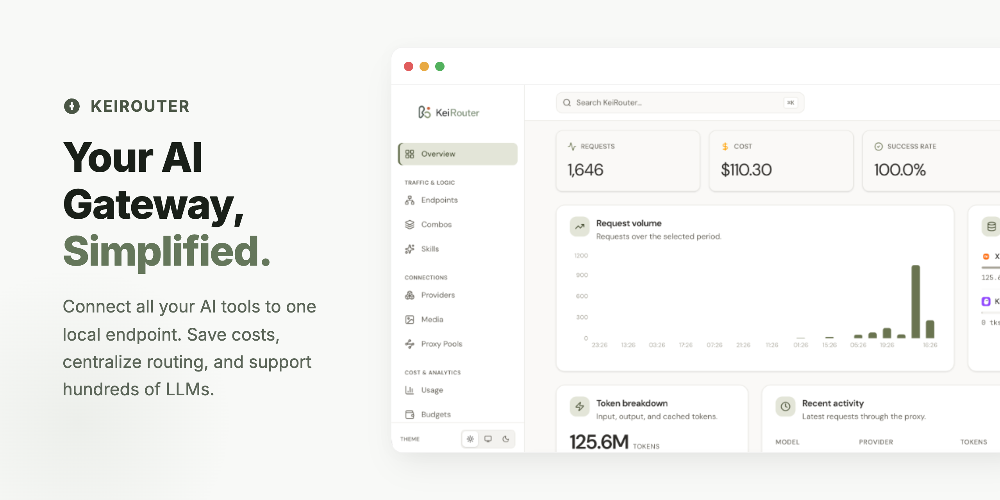

<p align="center">
  
</p>

<h1 align="center">KeiRouter 🚀</h1>

<p align="center">
  <strong>Your friendly, blazing-fast, self-hostable AI gateway.</strong>
</p>

<p align="center">
  <a href="https://github.com/mydisha/keirouter/actions/workflows/ci.yml"></a>
  <a href="https://go.dev/"></a>
  <a href="https://github.com/mydisha/keirouter/pkgs/container/keirouter"></a>
  <a href="LICENSE"></a>
</p>

<p align="center">
  
</p>

---

Hey there! 👋 Welcome to **KeiRouter**.

If you're using AI coding tools like Claude Code, Cursor, Cline, or literally any app that talks to OpenAI or Anthropic, you know the struggle: juggling API keys, hitting rate limits, and watching your token costs explode.

**KeiRouter fixes that.**

You just point all your AI tools to one local endpoint on your machine. KeiRouter acts as your smart middleman—routing requests to the right AI models, automatically falling back if a service goes down, caching repeated questions to save money, and compressing big chunks of text before they even reach the AI!

It's built with Go, which means it’s incredibly lightweight (using barely ~20MB of RAM) and starts up instantly. Plus, it comes with a beautiful dashboard to manage everything. ✨

> **Status:** Active development. See the [Architecture](#architecture) section for what's implemented.

## 🌟 Why you'll love KeiRouter

- 🔀 **One Endpoint to Rule Them All:** Your apps only need to speak OpenAI or Anthropic. KeiRouter handles translating your requests to whatever provider you actually want to use behind the scenes.
- 🛡️ **Never Stop Coding:** Hit a rate limit? Provider down? KeiRouter automatically falls back to your backup models so your workflow never gets interrupted.
- 💸 **Save Serious Cash:** 
  - **Input Compression:** It shrinks massive logs, code diffs, and file structures before sending them to the LLM. 
  - **Output Compression:** Tell the AI to speak in "terse mode" to cut out all the yapping and just give you the code.
  - **Savings Dashboard:** See exactly how much money you've saved with a detailed breakdown of input and output compression ratios.
- 💰 **Budget Engine:** Set per-key or per-organization USD and token hard limits with auto-cutoff to prevent unexpected bills.
- 🚦 **Rate Limiting:** Protect your gateway and upstream quotas with per-key RPM, TPM, and concurrency caps. Use global defaults or assign limits through reusable plans.
- 📋 **Plans & Policy Templates:** Create reusable budget templates with spend limits, token limits, rate limits, reset periods, allowed models, and alert thresholds. Assign plans to API keys so you define the rules once and apply them everywhere.
- 🎨 **Branding & White-Label:** Customize the entire dashboard and portal with your own name, logo, favicon, tagline, and color palette. Perfect for teams and organizations that want a white-labeled AI gateway.
- 🛠️ **Skills System:** Enhance your LLM interactions with built-in skills (Web Search, Image Generation, Text-to-Speech, etc.) natively routed through the gateway.
- 🔧 **CLI Tools Auto-Config:** KeiRouter generates ready-to-paste configuration snippets for 11+ coding tools—Claude Code, Cursor, Cline, GitHub Copilot, DeepSeek, KiloCode, and more.
- 🔐 **Super Secure:** Your API keys are encrypted with military-grade envelope encryption (AES-256-GCM). We never store plain text keys. Your local dashboard is also protected by a secure password and HMAC session cookies. Includes SSRF protection on all outbound requests.
- 📊 **Track Everything:** Wondering where your money is going? The beautiful dashboard gives you a detailed Quota Tracker, Provider usage breakdowns, real-time API Key monitoring, TTFT (time-to-first-token) metrics, and per-key usage summaries.
- ⚡ **Lightning Fast Caching:** Ask the same question twice? The semantic cache (powered by embeddings) remembers the answer and gives it back to you instantly, for exactly $0.00.
- 🌐 **Usage Portal:** Give your team members a dedicated portal to view their own API key usage, quota, and token savings—no admin access needed.

<p align="center">
  
</p>

<p align="center">
  
</p>

## 🚀 Let's get started!

### 1. Install & Run

**Homebrew (macOS & Linux):**
```bash
brew tap mydisha/keirouter https://github.com/mydisha/keirouter
brew install keirouter
```

Then:
```bash
keirouter -bootstrap   # create your first API key
keirouter              # start server on :20180
```

**One-Line (from source):**

Make sure you have Go 1.24+ and Node.js 20+, then paste this:
```bash
curl -fsSL https://raw.githubusercontent.com/mydisha/keirouter/main/scripts/quickstart.sh | bash
```

That's it! No manual cloning, no `.env`, no config files. Everything is automatic:
- Clones the repo to `~/keirouter`
- Installs dependencies
- Starts backend on `:20180` and dashboard on `:5180`
- Default dashboard password: `keirouter`

> **Already have the repo?** Just run `make setup` in the project root.

**Prefer Docker?** No Go/Node.js needed:
```bash
curl -fsSL https://raw.githubusercontent.com/mydisha/keirouter/main/scripts/install.sh | bash -s -- --docker
```

**VPS / Coolify / Production?**
```bash
git clone https://github.com/mydisha/keirouter.git
cd keirouter
cp .env.example .env   # set KEIROUTER_MASTER_KEY for production
docker compose up -d --build
```

See [deploy/README.md](deploy/README.md) for VPS, Postgres, and Coolify notes.

### 2. Set up your Dashboard
For the local quickstart, open **http://localhost:5180**. For Docker or the installed production server, open **http://localhost:20180**.
Log in with the default password: `keirouter` (it will ask you to change this immediately for security).

You can also create an API key directly from the terminal without the dashboard:
```bash
keirouter -bootstrap   # prints a kr_ key once
```

### 3. Connect your tools
In your favorite AI tool (like Cursor or Claude Code), set it up like this:
- **Base URL:** `http://localhost:20180/v1`
- **API Key:** Use the `kr_` key you generated in the dashboard or via bootstrap
- **Model:** Type the provider and model (e.g., `openai/gpt-4o`) or the name of a fallback chain you created!

## 🧠 Smart Routing (Chains)
Instead of just picking one model, you can create a "Chain" in the dashboard. 

For example, a chain named `coding` could try:
1. `openai/gpt-4o` (First choice)
2. `deepseek/deepseek-chat` (If GPT-4o fails or hits a rate limit)

Then, in your app, just set the model to `chain:coding` (or just `coding`) and let KeiRouter do the heavy lifting!

## 🔌 What else can it do?
KeiRouter isn't just for chat! It supports everything:
- **Image Generation** (`/v1/images/generations`)
- **Speech-to-Text** (`/v1/audio/transcriptions`)
- **Text-to-Speech** (`/v1/audio/speech`)
- **Web Search & Fetching** (`/v1/search`, `/v1/web/fetch`)
- **Embeddings** (`/v1/embeddings`)

## 🔑 Connect via OAuth (No API Keys needed!)
Tired of copying API keys? You can connect providers like Claude, GitHub Copilot, Gemini CLI, and more directly from the Connections page using OAuth. Just click, sign in, and KeiRouter handles securely refreshing your tokens in the background!

Supported OAuth/custom-auth flows include:
- **Claude** — Anthropic OAuth
- **GitHub Copilot** — GitHub device flow
- **Gemini CLI** — Google device flow
- **KiloCode** — Custom device-auth
- **Qoder** — PKCE device-token flow
- **CodeBuddy** (Tencent) — Browser-poll flow
- **Cursor** — Token import flow

## 📋 Plans & Budget Templates
Plans let you define reusable budget policies that can be assigned to any API key. Instead of configuring limits per key, create a plan once and apply it everywhere.

Each plan defines:
- **Spend Limit** — USD budget cap (in micro-dollars for precision)
- **Token Limit** — Maximum token usage
- **RPM Limit** — Maximum requests per minute for each assigned API key (`0` means unlimited)
- **TPM Limit** — Maximum estimated tokens per minute for each assigned API key (`0` means unlimited)
- **Concurrency Limit** — Maximum in-flight requests for each assigned API key (`0` means unlimited)
- **Reset Period** — `daily`, `weekly`, `monthly`, or `total`
- **Allowed Models** — Restrict to specific models using wildcard patterns (e.g., `claude-*`, `gpt-4*`); empty means all models allowed
- **Alert Threshold** — Percentage (1–100) at which alerts fire before budget exhaustion
- **Hard Cutoff** — When enabled, requests are blocked once the budget is exhausted; when disabled, usage is tracked but not enforced

A default plan is automatically created for each tenant. Plans can be managed from the dashboard's Plans page and assigned to API keys in the Keys settings.

## 🎨 Branding & White-Label
Make KeiRouter your own! The branding system lets you customize the entire look and feel of both the admin dashboard and the public-facing Usage Portal.

Customizable settings include:
- **App Name** — Replace "KeiRouter" with your organization's name
- **Logo URL** — Your custom logo (SVG/PNG)
- **Favicon URL** — Custom browser tab icon
- **Tagline** — Short text shown on the portal login screen
- **Color Palette** — Choose from predefined palettes: `sage-terra`, `ocean`, `midnight`, and more

All branding settings are managed from the **Settings → Branding** tab in the dashboard.

## 🔧 CLI Tools Auto-Config
KeiRouter can generate ready-to-paste configuration snippets for your favorite AI coding tools. Visit the **CLI Tools** page in the dashboard to get the exact config you need for:

Claude Code · Cursor · Cline · GitHub Copilot · DeepSeek · KiloCode · OpenCode · OpenClaw · Hermes · JCode · Droid · CodeBuddy

Just copy the snippet, paste it into your tool's config, and you're connected!

## 🌐 Usage Portal
The Usage Portal gives your team members a dedicated, non-admin view to monitor their own API usage. Each user can:
- View their API key's quota and spend
- Track token usage over time
- See token savings from input/output compression
- Monitor their assigned plan limits

The portal is accessible at `/portal` and requires only the API key to log in—no admin credentials needed.

<a name="architecture"></a>
## 🛠️ Architecture for the curious
Curious how it works under the hood? Here's the life of a request:
1. **Gateway:** Receives your HTTP request and parses the AI dialect (OpenAI, Anthropic, Gemini, etc.).
2. **Pipeline:** Compresses your inputs (Slimmer), injects cost-saving prompts (Terse mode), and checks your budget limits.
3. **Dispatch:** Picks the best provider account and handles fallbacks.
4. **Connector & Transform:** Talks to the provider and translates the response back into the format your tool expects.
5. **Meter:** Logs how many tokens you used so you can view it on the dashboard.

## 🌐 Supported Providers (60+)
KeiRouter connects to a massive roster of AI providers out of the box. Here's the full list:

**🧠 LLM / Chat Providers:**

| Category | Providers |
|----------|-----------|
| **Major Cloud** | OpenAI, Anthropic, Google Gemini, Vertex AI, Azure OpenAI, AWS (Kiro) |
| **Free / Free Tier** | OpenRouter (27+ free models), NVIDIA NIM, Ollama (Cloud & Local), Cloudflare Workers AI, BytePlus ModelArk |
| **China / Asia** | DeepSeek, Qwen (Alibaba), GLM, Kimi (Moonshot), MiniMax, Volcengine Ark, Xiaomi MiMo, SiliconFlow, iFlow |
| **OAuth / IDE** | Claude Code, GitHub Copilot, Cursor IDE, Cline, Kilo Code, OpenAI Codex, CodeBuddy (Tencent), Kimi Coding |
| **Performance** | Groq, Cerebras, SambaNova, DeepInfra |
| **Specialized** | xAI (Grok), Mistral, Perplexity, Cohere, AI21 Labs, Reka AI |
| **Aggregators** | Together AI, Fireworks AI, Nebius AI, OpenCode, AIML API, Vercel AI Gateway |
| **Emerging** | Blackbox AI, Chutes AI, Hyperbolic, Lepton AI, Kluster AI, MorphLLM, LongCat, Puter AI, GLHF, SumoPod, Scaleway, NLP Cloud, and many more |
| **Custom** | Any OpenAI-compatible or Anthropic-compatible endpoint (self-hosted, proxy, etc.) |

**🎨 Media & Search Providers:**

| Type | Providers |
|------|-----------|
| **Image Generation** | OpenAI DALL·E, Gemini Imagen, Cloudflare, Fal.ai, Stability AI, Black Forest Labs, Recraft, Topaz, Runway ML, NanoBanana, HuggingFace, SD WebUI, ComfyUI |
| **Text-to-Speech** | OpenAI TTS, NVIDIA NIM, ElevenLabs, Deepgram, Cartesia, PlayHT, AWS Polly, Google TTS, Edge TTS, Inworld, Coqui, Tortoise |
| **Speech-to-Text** | OpenAI Whisper, Groq Whisper, Deepgram, AssemblyAI, Gemini STT, HuggingFace |
| **Embeddings** | OpenAI, Gemini, Mistral, Together AI, Fireworks AI, Nebius, Voyage AI, Jina AI, OpenRouter |
| **Web Search** | Tavily, Exa, Serper, Brave Search, SearXNG, Perplexity, xAI, Google PSE, Linkup, SearchAPI, You.com, OpenAI |
| **Web Fetch** | Tavily, Exa, Firecrawl, Jina Reader |

## ⚙️ Configuration
By default, KeiRouter uses an embedded SQLite database (zero config required!). If you are deploying it for a team, you can use PostgreSQL. Just copy `config.example.yaml` and run with `-config`, or use environment variables like `KEIROUTER_SERVER__PORT=8080`. Docker/Coolify examples live in [deploy/README.md](deploy/README.md).

Enable the local in-memory rate limiter for single-instance deployments:

```yaml
limits:
  enabled: true
  backend: memory
  default_rpm: 600
  default_tpm: 200000
  default_concurrency: 50
  window: 1m
  cleanup_interval: 1m
```

Default limits apply only to API keys without an assigned plan. When a key has a plan, the plan's `rpm_limit`, `tpm_limit`, and `concurrency_limit` take precedence; `0` means unlimited.

## 🔒 Security Notes
- The admin API (`/api/*`) is restricted to your local machine by default. If you expose it to the internet, put it behind a reverse proxy and set a stable `master_key`!
- **Don't lose your master key!** It is the root of trust for all your encrypted credentials.

## 🧑‍💻 Development & Contributing
Want to hack on KeiRouter?
```bash
make setup   # First time: installs deps + starts backend (:20180) and dashboard (:5180)
make dev     # After first time: just starts the servers
```
Contributions are always welcome! Check out [CONTRIBUTING.md](CONTRIBUTING.md) to see how you can get involved.

## 🛡️ Security Vulnerabilities
If you find a security issue, please check [SECURITY.md](SECURITY.md) instead of opening a public issue.

## 📄 License
MIT License - See [LICENSE](LICENSE) for details.
